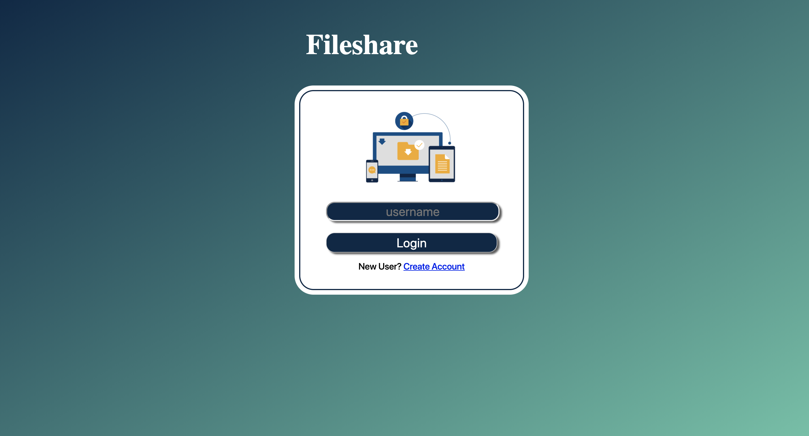
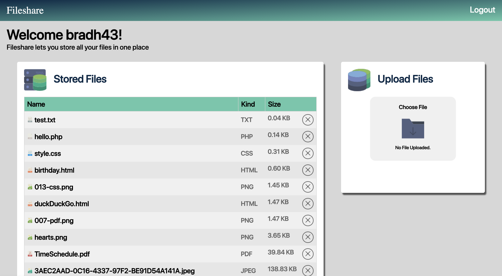

# Filesharing System #

Simple file sharing site that supports uploading, viewing, and deleting files associated with various users. The website can be seen at the following link: http://ec2-18-219-118-115.us-east-2.compute.amazonaws.com/~bradh43/module2/fileShare/login.php?
You can create a new account or you can use the the account name "test" to login.

## Features ##
* Added the ability for a new user to create an account. This allows users to be added to the users.txt file and also creates a new directory for their uploads to be stored on the server.
* Added additional file information, including file type and the size. In addition to this if you click on the table headers (ie. Name, Kind, Size) you can sort by that header. If you click the same header again it will reverse the order.

## Login Page Screen Shot

    

 

## Home Page Screen Shot

    

 
